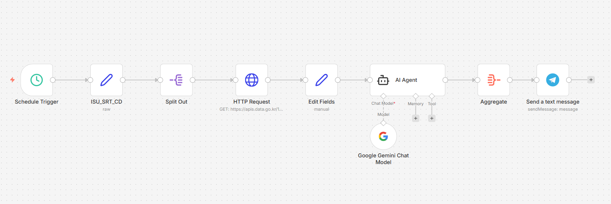

# AI Stock Alert Workflow (n8n)

This project is a simple stock monitoring workflow built with n8n.

It collects stock data, analyzes it with AI, and sends short summaries to Telegram automatically.

## Workflow

Schedule Trigger
→ Set Watchlist
→ Fetch Stock Data
→ Format Data
→ AI Analysis
→ Aggregate Results
→ Send Telegram Message

## Purpose

The main goal of this workflow is to save time when checking multiple stocks.

Instead of reading raw market data, the workflow creates short and clear summaries.

## Prompt Optimization

One important part of this project was writing efficient prompts.

Because free APIs have token limits, I tried to keep the prompts short and clear.

The goal was:

* use fewer tokens
* reduce API load
* avoid node overload
* keep output quality high

This helped improve efficiency while still getting useful information.

## Privacy

For public upload, all sensitive data was replaced with placeholder variables.

Example:

* `YOUR_API_KEY`
* `YOUR_TELEGRAM_CHAT_ID`
* `TICKER_001`
* `WATCHLIST_ITEM_001`

This keeps personal information and stock preferences private.

## Tech Stack

* n8n
* Google Gemini API
* Telegram Bot API
* Stock Market API